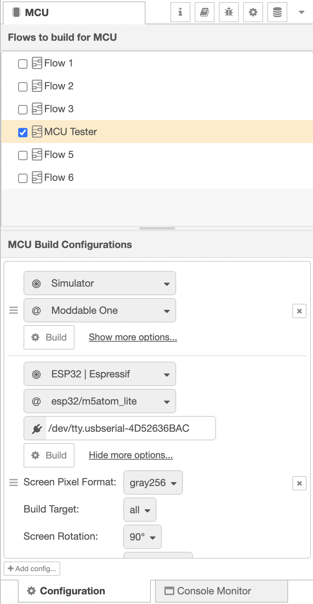
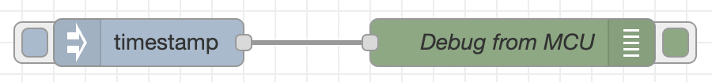
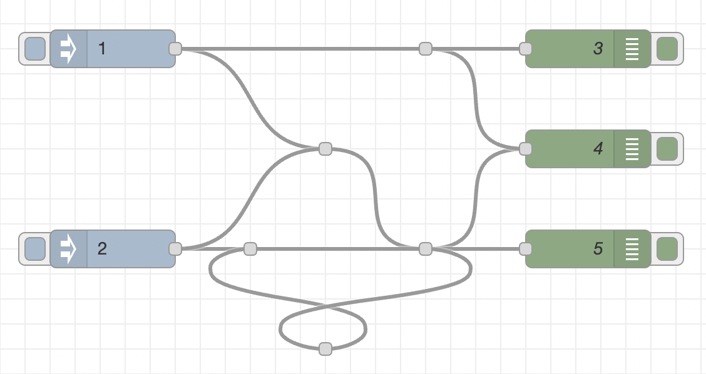

# node-red-mcu-plugin
Plugin to integrate [Node-RED MCU Edition](https://github.com/phoddie/node-red-mcu) into the Node-RED editor.

## Overview
Node-RED MCU Edition is an implementation of the Node-RED runtime that runs on resource-constrained microcontrollers (MCUs).

This plugin supports the process to build flows with & for Node-RED MCU edition and interfaces between the Node-RED Editor and a connected MCU.

It adds a side panel labeled "MCU" into the Node-RED Editor.



The top section of this side panel allows to select the flows that shall be build for the MCU environment.
Please be aware that **you have to deploy the selected flows** after you've made your choice.

> Please be aware, that flows dedicated to MCU are in stand-by mode, awaiting an incoming MCU connection.
> De-select them & deploy again to enable standard Node-RED functionality.

In the bottom section of the side panel, several configurations defining compiler options may be prepared. This allows e.g. to select the target platform or the port used to address a dedicated hardware device. For option reference, see the `mcconfig` [documentation](https://github.com/Moddable-OpenSource/moddable/blob/public/documentation/tools/tools.md#arguments) of the Moddable SDK.

Building the selected flows is as simple as triggering the `Build` button of one of the defined build configurations.

You may follow the build process on the tab `Console Monitor`.

## Implemented Functionality

- [x] Select flows to build.
- [x] UI to define build targets & parameters.
- [x] Console monitor - to follow the build process.
- [x] Display status message of a node (running @ MCU) in the editor.
- [x] Forward user trigger (e.g. `inject` node) to MCU.
- [x] Debug node (from MCU back into the editor).
- [x] Create `manifest.json` files for (any kind of) nodes / npm packages.
- [x] `manifest.json` [library](#manifestjson) - providing pre-defined build parameters for (node modules and) npm packages
- [x] Include relevant config nodes in the MCU build.
- [x] Junction node resolving.
- [x] Link node resolving.
- [x] Support for ui_nodes.
- [x] Build flows on macOS.
- [x] Build flows on Windows.
- [x] Build flows on Linux.
- [x] Build flows when running Node-RED as service on Raspberry Pi.


## Test Case
Although it looks minimalistic, the following flow shows most of the funcitonality in action:



<details>
  <summary>flow.json</summary>

``` json
[
    {
        "id": "18785fa6f5606659",
        "type": "tab",
        "label": "MCU Tester",
        "disabled": false,
        "info": "",
        "env": [],
        "_mcu": true
    },
    {
        "id": "1eeaa9a8a8c6f9f8",
        "type": "inject",
        "z": "18785fa6f5606659",
        "name": "",
        "props": [
            {
                "p": "payload"
            }
        ],
        "repeat": "",
        "crontab": "",
        "once": false,
        "onceDelay": "3",
        "topic": "",
        "payload": "TEST",
        "payloadType": "str",
        "_mcu": true,
        "x": 330,
        "y": 200,
        "wires": [
            [
                "8f505d28fa1fb6e0"
            ]
        ]
    },
    {
        "id": "da00311ba5215864",
        "type": "debug",
        "z": "18785fa6f5606659",
        "name": "Debug from MCU",
        "active": true,
        "tosidebar": true,
        "console": false,
        "tostatus": true,
        "complete": "true",
        "targetType": "full",
        "statusVal": "payload",
        "statusType": "auto",
        "_mcu": true,
        "x": 690,
        "y": 200,
        "wires": []
    },
    {
        "id": "8f505d28fa1fb6e0",
        "type": "lower-case",
        "z": "18785fa6f5606659",
        "name": "",
        "_mcu": true,
        "x": 490,
        "y": 200,
        "wires": [
            [
                "da00311ba5215864"
            ]
        ]
    }
]
```
</details>

## Prerequisites
1) [node-red](https://www.nodered.org)
2) [Moddable SDK](https://github.com/Moddable-OpenSource/moddable)

## Installation

``` bash
cd <userDir>
npm install https://github.com/ralphwetzel/node-red-mcu-plugin
```

> This installs as well [node-red-mcu](https://github.com/phoddie/node-red-mcu).

Please refer to the [Node-RED documentation](https://nodered.org/docs/user-guide/runtime/configuration) for details regarding `<userDir>`.

### Raspberry Pi: Additional preparation steps 

#### Define MODDABLE
The Node-RED documentation states a [slick comment]((https://nodered.org/docs/user-guide/environment-variables#running-as-a-service)) that things are a bit different when Node-RED is run as a service:
> When Node-RED is running as a service having been installed using the provided [script](https://nodered.org/docs/getting-started/raspberrypi), it will not have access to environment variables that are defined only in the calling process.

The _solution_ is stated as well:

> In this instance, environment variables can be defined in the settings file by adding `process.env.FOO='World';`
placed outside the module.exports section. Alternatively, variables can be defined as part of the systemd service by placing statements of the form `ENV_VAR='foobar'` in a file named environment within the Node-RED user directory, `~/.node-red`.

Thus, please add `MODDABLE` as environment variable to your `settings.js`.

``` javascript
module.exports = {
[...]
}

// Please add MODDABLE *outside* the module.exports definition!
process.env.MODDABLE = "/home/pi/Projects/moddable"
```

Make sure to provide the absolute path to the `MODDABLE` directory. If you're unsure, just run the following command in a shell to get the current definition:

``` bash
pi@somebox:/ $echo $MODDABLE
/home/pi/Projects/moddable
pi@somebox:/ $ 

```

#### Update your IDF toolchain
There's a [significant issue in IDFv4.4](https://github.com/espressif/esp-idf/issues/7857) that lets the build process error out in certain situations with a dramatic comment:

> gcc is not able to compile a simple test program.

Whereas the issue documentation does not provide a solid fix for this situation, you **might be** able to overcome it by updating your toolchain - to the latest `release/v4.4` branch.

``` bash
cd ~/esp32/esp-idf
git checkout release/v4.4
git submodule update
./install.sh
. export.sh
```

Please be advised that updating the toolchain in that way could have sideeffects that cannot be predicted & might lead you into additional trouble! Thus: take care!

## Next Steps / To Do List
- [ ] Add further Node.js modules
- [ ] Provide better support for CommonJS modules
- [ ] Bug fixing! :sweat_smile:

## Technical Details

### Build Environment
This plugin creates the build environment in 
```
<userDir>/mcu-plugin-cache
```
Please refer to the [Node-RED documentation](https://nodered.org/docs/user-guide/runtime/configuration) for details regarding `<userDir>`.

There's a dedicated folder for each of the build configurations you have defined in the Node-RED editor.
This folder - currently - is being emptied prio to each build run. 

### Junction node resolving
Junction nodes are a brilliant feature of the Node-RED editor to support the creation of cleary structured flows.
In essence, they yet are just visual sugar to please the operator's eye. In runtime conditions, they still demand resources like any other node does.
As we consider resources as always rare - which is especially true for any MCU - this plugin thus replaces all junction nodes by direct connections between two active nodes. It as well removes circular references in the junction node chain - if they exists.

To test this feature, you may start with the [displayed flow](https://github.com/ralphwetzel/node-red-mcu-plugin/tree/main/test/junction_resolver_test.json):




### manifest.json
The [documentation of Moddable SDK](https://github.com/Moddable-OpenSource/moddable/blob/public/documentation/tools/manifest.md#manifest) states that

> [a] manifest is a JSON file that describes the modules and resources necessary to build a Moddable app.

One major task of this plugin is therefore the creation of the necessary `manifest.json` file(s) to enable the process of building the flows for the MCU.

As all Node-RED nodes are organized as `npm` packages, this plugin extracts the necessary information from the dedicated `package.json` file(s) to process it into a manifest. Dependencies are resolved & additional manifests created as demanded.

The manifests are organized in a structure mirroring the `node_modules` directory.

There are two issue though:
- Dependencies, that are not listed in `package.json` cannot be resolved. This is especially relevant in cases when a node `require`s one of the `Node.js` core libraries.
- The `manifest.json` auto creation process (currently & definitely for some time) has it's limitations.

To compensate for these issues, this plugin provides a (currently very small, potentially growing) manifest library for dedicated `npm` packages and `Node.js` modules. This allows to provide fine-tuned manifests that are guaranteed to be exhaustive; in the process to setup manifests those from the library have preference versus the generated ones.

> **This manifest library calls for your contribution!** Feel free to provide manifests for the nodes & packages you're working with. Each  manifest added improves the performance of the node-red-mcu eco system!

Let me give you a <span style="color: red">**WARNING:**</span>
I'm pretty sure that **every** (non-standard) node you try to build for MCU will currently demand some additional efforts. Please raise an issue if you need support setting up the `manifest.json` accordingly.

