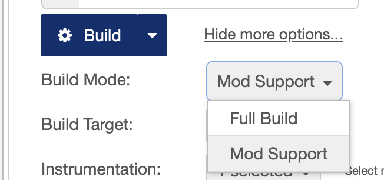
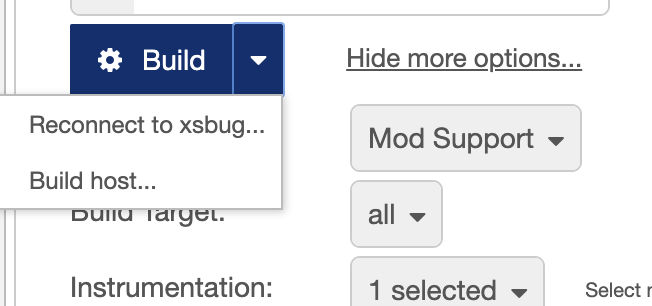

# Mods Support in node-red-mcu-plugin

This document intends to describe the current status of Mods support in `node-red-mcu-plugin`.

Mods support currently is an experimental feature. To enable it, you have to define

``` js
process.env.MCU_EXPERIMENTAL = 1
```

in your `settings.js` definition file.

## Build mode
The Build Configuration Panel now offers a new defintion property, called `Build Mode` - right below the Build button. You may select here to perform either a full build (the current standard) or to enable Mod Support:




## Host system setup
To run mods on an MCU you first have to build & flash the Host system to the MCU.
This - usually - needs to be done only once.

After selecting `Mod Support` as build mode, the dropdown menu of the Build button provides a dedicated action to build this Host system:



The host will report ready & waiting for the upload of flows when build & flashed successfully.

## Building Mods
After selecting `Mod Support` as build mode, building Mods is as easy as clicking the Build button.

## ToDos
[ ] Provide better creation params to give the mod enough space to be uploaded.